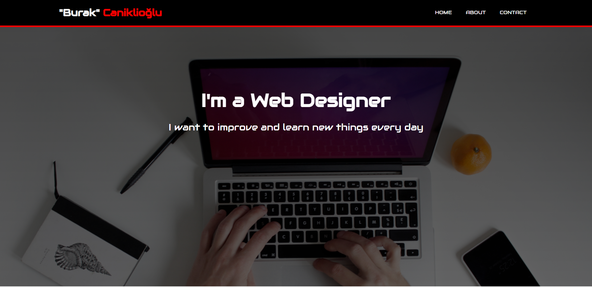
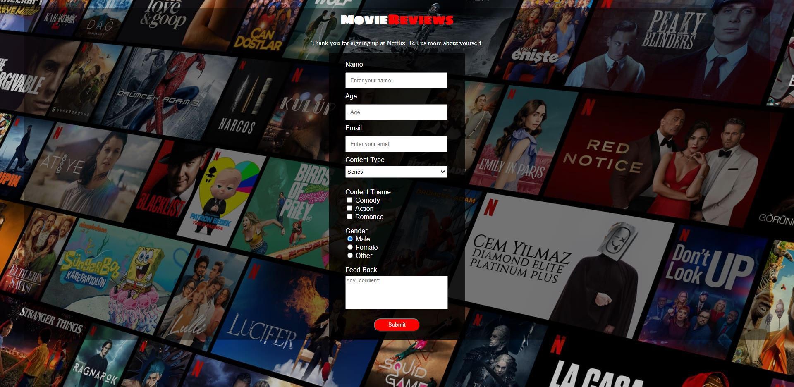
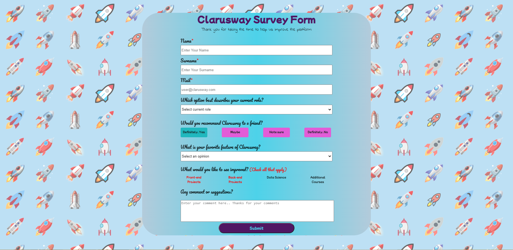
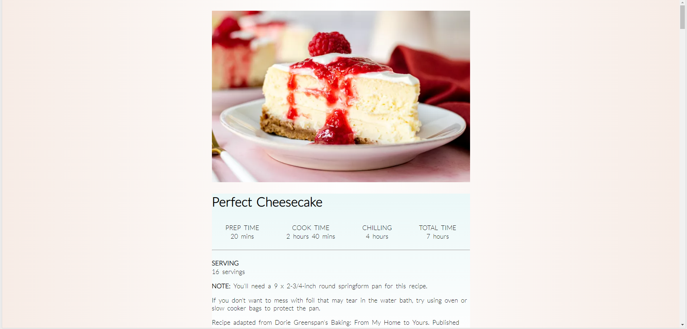
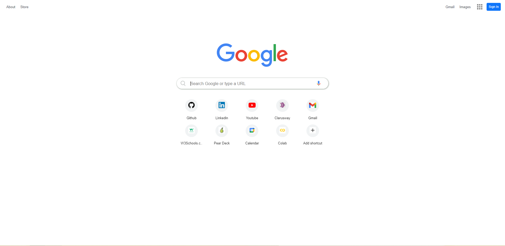
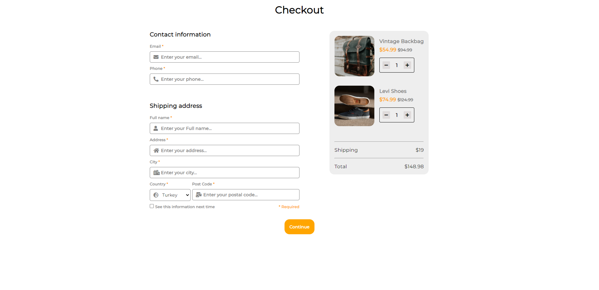
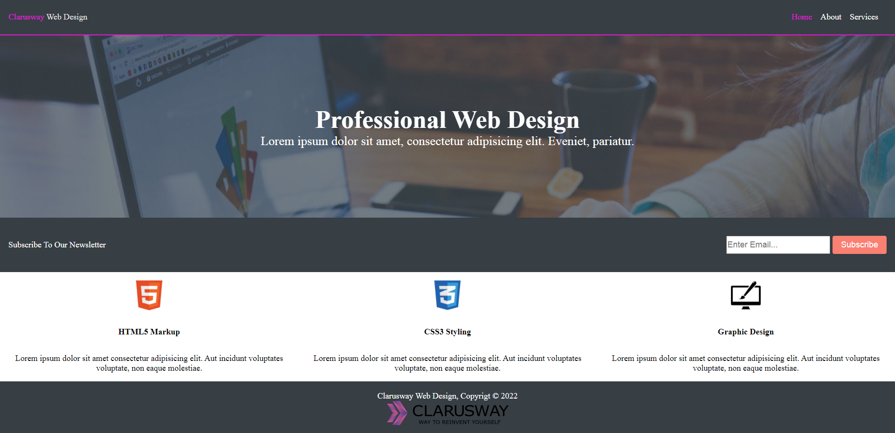

# Static-Projects-with-HTML-and-CSS
- [Personal Website1](#personal-website1)
  - It is a personal website work with basic elements and properties.
- [Survey Form](#survey-form)
  - In this study, I created a survey form that will allow viewers to comment on the movie later and watch the types of content they like within the information they provide.

- [Survey Form Bootcamp](#survey-form-bootcamp)
  - It was created to receive feedback from students and mentors participating in the bootcamp.
  
- [Perfect Cheesecake Recipe](#perfect-cheesecake-recipe)
  - A cheesecake recipe that will allow you to have a good time with your friends.

- [Google Landing Page](#google-landing-page)
  - I tried to create Google's new tab page

- [Read Newborn's Mind](#read-newborns-mind)
  - A website to understand the behavior of newborn babies that I created with the concept of parallax.

- [Parallax Website Clarusway](#parallax-website-clarusway)
  - The website that I created with the concept of parallax, promoting Clarusway

- [Checkout Form](#checkout-form)
  - I tried to create a checkout form with responsive design.

- [Website Page Design](#website-page-design)
  - It is multi-page website of a company providing web services
## Personal Website1

 
 

## Survey Form

 
 

## Survey Form Bootcamp

 
 

## Perfect Cheesecake Recipe

 
 

## Google Landing Page

 
 

## Read Newborn's Mind

 
 

## Parallax Website Clarusway

 
 

## Checkout Form

 
 

## Website Page Design

